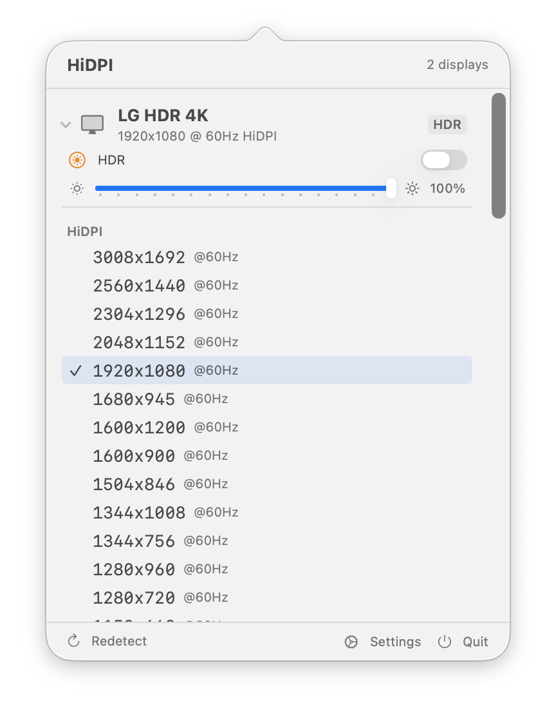

# HiDPI

A macOS tool for managing HiDPI settings and brightness on external monitors.



## Why I Built This

I tend to build my own tools whenever existing Mac software doesn't quite work the way I need. Apps like BetterDisplay and Display Buddy handle HiDPI and display management well in general, but DDC/CI brightness control never worked reliably with my monitors — a 27-inch LG 4K and a 32-inch LG 4K. It was frustrating enough that I decided to build something tailored to my setup, learning about macOS display internals along the way. The entire project was vibe-coded: I described the features I wanted and iterated from there.

## Install

```bash
brew tap hulryung/tap
brew install --cask hidpi
```

Or download the latest DMG from [Releases](https://github.com/hulryung/hidpi/releases).

After installation, grant **Accessibility** permission in **System Settings > Privacy & Security > Accessibility** to enable keyboard brightness key sync with external monitors via DDC/CI.

## What It Does

HiDPI provides two tools for controlling external monitors on macOS:

- **HiDPITool** — A command-line tool for display management tasks (mode switching, overrides, EDID inspection, etc.)
- **HiDPIApp** — A menu bar app that gives you quick access to display modes, brightness control, and HDR toggling from the system tray

The core problem it solves: enabling HiDPI (Retina) resolutions on external monitors that macOS doesn't natively offer HiDPI for, and providing reliable DDC/CI brightness control that syncs with your keyboard brightness keys.

## Features

- **Display mode management** — List, inspect, and switch display modes including HiDPI
- **Display Override generation** — Create override plists to unlock HiDPI resolutions on any external monitor
- **DDC/CI brightness control** — Adjust external monitor brightness via the DDC/CI protocol over I2C
- **Keyboard brightness sync** — Brightness keys (F1/F2) control both built-in and external monitors simultaneously, with software dimming for extra-low brightness
- **HDR toggle** — Enable or disable HDR per display
- **Virtual displays** — Create HiDPI virtual displays for testing or screen sharing
- **EDID parsing** — Read and decode display EDID data

## Usage

### HiDPIApp (Menu Bar App)

Build and launch:

```bash
cd HiDPIApp
swift build
open .build/debug/HiDPIApp
```

The app appears in your menu bar with a display icon. Click it to:
- View all connected displays and their current modes
- Switch resolutions (with a 15-second rollback safety timer)
- Adjust brightness with a slider
- Toggle HDR

For keyboard brightness sync, grant **Accessibility** permission in System Settings > Privacy & Security > Accessibility.

### HiDPITool (CLI)

Build and use:

```bash
cd HiDPITool
swift build

# List all displays
.build/debug/HiDPITool list

# Show available modes for the main display
.build/debug/HiDPITool modes main

# Switch to a specific mode
.build/debug/HiDPITool set main 42

# Enable flexible HiDPI scaling (requires sudo)
sudo .build/debug/HiDPITool override create main --flexible

# Add specific HiDPI resolutions
sudo .build/debug/HiDPITool override create 0x1234 --res 2560x1440 --res 1920x1080

# Preview an override plist without installing
.build/debug/HiDPITool override create main --res 2560x1440 --preview

# Read EDID data
.build/debug/HiDPITool edid main

# Create a virtual HiDPI display
.build/debug/HiDPITool virtual create --width 5120 --height 2880 --name "5K HiDPI"
```

Use `hidpi help` for the full command reference.

## Build

```bash
# CLI tool
cd HiDPITool && swift build

# Menu bar app
cd HiDPIApp && swift build
```

## Requirements

- macOS 13+
- Apple Silicon or Intel Mac

## Note

This project uses Apple private APIs (SkyLight, CoreDisplay, DisplayServices, etc.) and **cannot be distributed via the App Store**. Direct distribution only. These APIs may break across macOS updates.

## License

MIT License — See [LICENSE](LICENSE) for details.

## Acknowledgments

See [ACKNOWLEDGMENTS.md](ACKNOWLEDGMENTS.md) for open-source projects referenced by this project.
